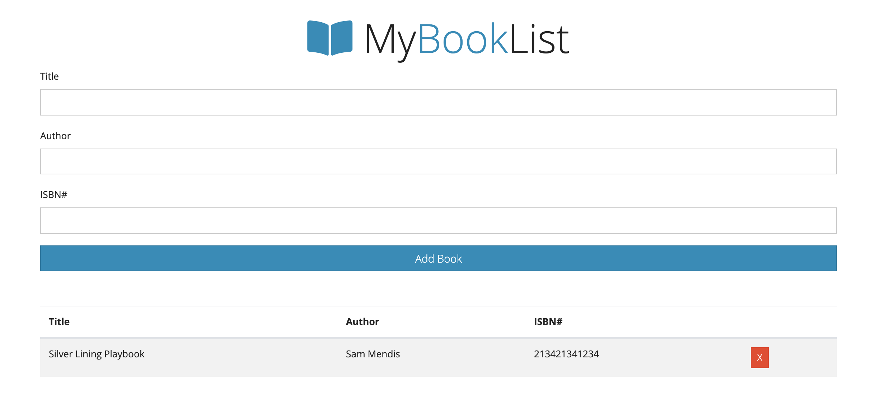

# Creating a book store app using OOP

You should have the following features in the bookly app:

- User can add a new book by adding the name, author and url of the image
- Once added the book will be marked not read
- You can change the state of the book to `Read` and it will be marked as completed
- User can delete the book

